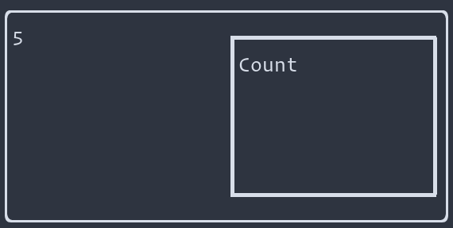

# Seven GUIs in reflex-vty, Part 1: The Counter

> 7GUIs defines seven tasks that represent typical challenges in GUI programming
> -- [7GUIs: A GUI Programming Benchmark](https://eugenkiss.github.io/7guis/)

[7GUIS](https://eugenkiss.github.io/7guis/) is a set of 7 typical GUI programming tasks of varying levels of complexity. We're going to implement the 7GUIs in [Haskell](https://haskell.org) using the [reflex](https://reflex-frp.org) [functional reactive programming](https://en.wikipedia.org/wiki/Functional_reactive_programming) framework.

## The structure of this document

This tutorial is packaged, like most Haskell applications and libraries, as a [cabal](https://www.haskell.org/cabal/) package. It was created by running `cabal init`. One thing that is a little unusual, though not unheard of, is that the source file for this package is a [literate Haskell](https://wiki.haskell.org/Literate_programming) file. Everything outside of code blocks that begin with "\`\`\`haskell" will be ignored by the compiler.

We use the [markdown-unlit](https://github.com/sol/markdown-unlit) preprocessor to allow us to write the tutorial in markdown (rather than one of Haskell's built-in literate document styles) but still allow the code blocks to be recognized and compiled.

Each of the code snippets will be a function that can be run on its own in the REPL. The functions will gradually grow in complexity until the final version implements the desired GUI. This isn't how you'd normally program, but we're trying to "show our work" so that you can see how we build up the GUI in smaller steps.

> NB: One limitation of the format we've chosen (a single literate haskell source file) is that the module imports have to be declared in one place, above all of the code, so the first code you see will include imports that aren't needed until later. We'll use qualified imports to try to make it clear why something is being imported.

## Setting up and building

### Getting started with reflex-platform and nix

We're going to use [reflex-platform](https://github.com/reflex-frp/reflex-platform) and [nix](https://nixos.org/nix) to build this project. The readme of the former explains why:

> Reflex Platform is a curated package set and set of tools that let you build Haskell packages so they can run on a variety of platforms. Reflex Platform is built on top of the nix package manager.
> There are five main reasons to use Reflex Platform:
>
> 1. It's curated: the core packages in Reflex Platform are known to work together and are tested together.
> 2. It's cached: the core packages in Reflex Platform are cached so you can download prebuilt binaries from the public cache instead of building from scratch.
> 3. It's consistent: nix locks down dependencies even outside the Haskell ecosystem (e.g., versions of C libraries that the Haskell code depends on), so you get completely reproducible builds.
> 4. It's cross-platform: Reflex Platform is designed to target iOS and Android on mobile, JavaScript on the web, and Linux and macOS on desktop. It's Haskell, everywhere.
> 5. It's convenient: Reflex Platform comes packaged with tools to make development easier, like a hoogle server that you can run locally to look up definitions.

To set up reflex-platform and nix, follow the directions [here](https://github.com/reflex-frp/reflex-platform#setup) and then come back and we can get started.

### Running this project

We use reflex-platform to build an environment that contains all the dependencies you need to build this project. You can either compile this project and run the resulting executable, or open it in an interpreter and run it from there. The latter makes for a quicker development cycle if you're modifying any of the example code.

#### The development environment

To enter a shell from which you can build the project or enter the REPL, run `nix-shell` from the project directory.

You'll be put in a nix-shell that looks something like this:

```bash
[nix-shell:/path/to/project]$
```

This tells you that you're in a "nix-shell" environment. Inside this environment, the dependencies for our project are ready for us to use.

From within the nix-shell, you can run:

* `cabal repl seven-guis-vty-counter` to enter a REPL
* `cabal build seven-guis-vty-counter` to build the project
* `ghcid -c "cabal repl seven-guis-vty-counter"` to watch source files and display any errors or warnings that arise when they change

From within the REPL, you can run any of the functions defined later in this tutorial (e.g., `hello`) to see what it does.

#### nix-build

To compile the project via nix, run `nix-build -A seven-guis-vty-counter` from the project directory. This will create a `result` symlink in your project folder. Run the program by executing `result/bin/seven-guis-vty-counter`.

Enough with the preliminaries; let's get on to the code.

## The code

### Imports

As mentioned above, we'll start by importing the libraries our project depends on. Don't worry if you don't understand why something is in the import list: we'll explain that as we go.

```haskell
-- These imports are unqualified because we'll be using them heavily
import Reflex
import Reflex.Vty

import qualified Graphics.Vty as V
import qualified Data.Text as T
```

### Starting up a reflex-vty application

Haskell applications have a `main :: IO ()` function that serves as the entrypoint to the program.

We define our main function at the very bottom of this tutorial, but we'll be writing many functions that match this type signature and could act as the definition of `main`.

reflex-vty provides a function called [`mainWidget`](https://hackage.haskell.org/package/reflex-vty-0.2.0.1/docs/Reflex-Vty-Widget.html#v:mainWidget) that starts up a terminal application. The type signature for `mainWidget` looks like this:

```
mainWidget :: (forall t m. (MonadVtyApp t m, HasImageWriter t m, MonadNodeId m, HasDisplayRegion t m, HasFocusReader t m, HasTheme t m, HasInput t m) => m (Event t ())) -> IO ()
```

That's a lot to look at. Let's start with the part after `=>`:

```
m (Event t ())) -> IO ()
```

`mainWidget` takes one argument, a UI that produces an `Event t ()`. When this event fires, it indicates that the program should terminate. It could represent, for example, a user pressing `Ctrl+c`.

The `m` around `m (Event t ())` represents the fact that this event is the result of some UI, action, or computation that is being _run_. The part of the type signature between `::` and `=>` tells us about the constraints on (and capabilities of) that `m` context. You can probably guess from the name of some of them what they represent (e.g., `HasInput t m`).

`mainWidget`'s return value is `IO ()` which, not coincidentally, is the type `main :: IO ()` expects.

> For more on basic FRP types in reflex (like `Event`), take a look at the [learning materials on the reflex-frp.org site](https://reflex-frp.org/resources).

### Before we go in, we need a way out

We can call `mainWidget` but we need to provide that first argument. At a minimum, when a user presses `Ctrl+c`, we want the progam to terminate.  The [`keyCombo`](https://hackage.haskell.org/package/reflex-vty-0.2.0.1/docs/Reflex-Vty-Widget.html#v:keyCombo) function takes a combination of keys and produces an event that fires whenever that key combination is pressed.

```
keyCombo :: (Reflex t, Monad m, HasInput t m) => KeyCombo -> m (Event t KeyCombo)
```

Note that `keyCombo` requires `HasInput t m`, which happens to be one of the constraints that the argument to `mainWidget` satisfies. Lucky us.

It's argument is a `KeyCombo`, which is a pair of some key and some combination of modifiers (e.g., Shift, Ctrl, Alt).

```haskell
ctrlc :: (Monad m, Reflex t, HasInput t m) => m (Event t KeyCombo)
ctrlc = keyCombo (V.KChar 'c', [V.MCtrl])
```

Trying to call mainWidget with `ctrlc` as its argument won't quite work, because `mainWidget` wants an `Event t ()` and we've produced an `Event t KeyCombo`.

We can use [`fmap`](https://hackage.haskell.org/package/base-4.16.2.0/docs/Prelude.html#v:fmap) to change the contents of the event:

```haskell
aWayOut :: IO ()
aWayOut = mainWidget $ do
  getout <- ctrlc
  return $ fmap (\_ -> ()) getout
```

> This could be written in other ways, but we're going to try to keep the code as plain and explicit as possible here.

Now, if you go into your REPL and run `aWayOut`, you should see a ... blank screen. Not very exciting. What is exciting, though, is that you can escape that blank screen and get back to the REPL by pressing `Ctrl+c`.

> As an exercise, you could try to add an alternative key combination that also exits the program. How about `Esc`?

## The counter GUI

Now we've got somewhere to put our first GUI. Our mission, should we choose to accept it, is to:

> build a frame containing a label or read-only textfield *T* and a button *B*. Initially, the value in *T* is “0” and each click of *B* increases the value in *T* by one.

The exemplar for this GUI assignment looks like this:


This GUI has a few parts: the frame, the textfield, and the button. We'll start by getting those all on the screen, and then we'll figure out how to hook them up.

### The frame

This isn't the first time someone has had to draw a box around a GUI, thankfully. The [`box`](https://hackage.haskell.org/package/reflex-vty-0.2.0.1/docs/Reflex-Vty-Widget-Box.html#v:box) function from reflex-vty seems to fit the bill. We need to supply it with a style for the box border, and something to run inside the box.

For now, we'll just tell it to do nothing inside the box, by calling [`blank`](https://hackage.haskell.org/package/reflex-vty-0.2.0.1/docs/Reflex-Vty-Widget.html#v:blank).

```haskell
frame :: IO ()
frame = mainWidget $ do
  getout <- ctrlc
  box (pure roundedBoxStyle) blank
  return $ fmap (\_ -> ()) getout
```

We have a box.


### The label

Now, let's add the label component. It'll eventually show the number of button clicks, but for now we'll give it a placeholder string.

We'll use the [`text`](https://hackage.haskell.org/package/reflex-vty-0.2.0.1/docs/Reflex-Vty-Widget-Text.html#v:text) function, which takes a `Behavior t Text` and displays it. A `Behavior` is a value that changes over time. We expect the text to change as the user clicks the "Count" button, so this sounds just right.

Instead of `blank`, we'll plug our `text` element right into the `box`.

```haskell
frameWithLabel :: IO ()
frameWithLabel = mainWidget $ do
  getout <- ctrlc
  box (pure roundedBoxStyle) $ do
    text "Nothing to see here"
  return $ fmap (\_ -> ()) getout
```

And here's what that should look like:


### The button

Next, let's add the button. You've probably guessed that reflex-vty has a function that would be useful here, and it does not disappoint. We'll use [`textButton`](https://hackage.haskell.org/package/reflex-vty-0.2.0.1/docs/Reflex-Vty-Widget-Input.html#v:textButton), which is a button containing some text. In our case, the button will say "Count", just like the exemplar from 7GUIs.

> You may notice that `textButton` takes a `Behavior t Text` as its label argument. The button text can change over time! We're not particularly interested in this feature right now, so we just provide some fixed text. The magic of `OverloadedStrings` lets us write a `Behavior t Text` as a string literal.

```haskell
frameWithLabelAndButton :: IO ()
frameWithLabelAndButton = mainWidget $ do
  getout <- ctrlc
  box (pure roundedBoxStyle) $ do
    text "Nothing to see here"
    textButton def "Count"
    return ()
  return $ fmap (\_ -> ()) getout
```

Uh oh, we've lost the text. It looks like the button has taken over the whole box! Perhaps its covering up the text?


Looks like we need to figure out how to lay things out inside our little terminal app.

### Layout

There are a few ways we can lay things out in reflex-vty, from manually specifying locations to using some helpful [layout algorithms](https://hackage.haskell.org/package/reflex-vty-0.2.0.1/docs/Reflex-Vty-Widget-Layout.html#g:12). Using the [`Layout`](https://hackage.haskell.org/package/reflex-vty-0.2.0.1/docs/Reflex-Vty-Widget-Layout.html#t:Layout) functionality of reflex-vty, you can specify some layout constraints and have reflex-vty figure out where to draw things to satisfy those constraints.

We'll specify our layout constraints using the [`tile`](https://hackage.haskell.org/package/reflex-vty-0.2.0.1/docs/Reflex-Vty-Widget-Layout.html#v:tile) function for things that are focusable and the [`grout`](https://hackage.haskell.org/package/reflex-vty-0.2.0.1/docs/Reflex-Vty-Widget-Layout.html#v:grout) for things that are not (but nevertheless take up space). Each of these functions takes a `Constraint` that determines how it shares space with other widgets.

First, we need to get into a context where we can run `Layout` actions. The function [`initManager_`](https://hackage.haskell.org/package/reflex-vty-0.2.0.1/docs/Reflex-Vty-Widget-Layout.html#v:initManager_) seems to fit the bill:

```
initManager_ :: (HasDisplayRegion t m, Reflex t, MonadHold t m, MonadFix m) => Layout t (Focus t m) a -> m a
```

The documentation says it will "Initialize a Layout and Focus management context." We're not particularly concerned with the `Focus` part right now, but we do want to run a `Layout` action, and the argument to `initManager_` is such an action.

We'll start by wrapping our entire user interface in `initManager_` but that requires that each element of our interface declare its layout constraints.

We can put `grout flex` around our `box`. According to the [documentation](https://hackage.haskell.org/package/reflex-vty-0.2.0.1/docs/Reflex-Vty-Widget-Layout.html#v:flex), `flex` is "shorthand for constructing a constraint of no minimum size." We don't want to constrain the size of the box, and would like it to take up as much space as it can, since it's the entire UI.

```haskell
flexbox :: IO ()
flexbox = mainWidget $ initManager_ $ do
  getout <- ctrlc
  grout flex $ box (pure roundedBoxStyle) $ do
    text "Nothing to see here"
    textButton def "Count"
    return ()
  return $ fmap (\_ -> ()) getout
```

Running this doesn't result in any visible change compared to our last attempt, but that's because the UI elements _inside_ the box haven't been given any layout constraints yet.

Next, we'll add `grout flex` to the `text` line, to indicate that we want the text to take up as much space as it wants (subject to the needs of other elements).

The `textButton` is a focusable element. That is, we expect users to be able to focus and interact with it. So, we'll wrap that one in [`tile`](https://hackage.haskell.org/package/reflex-vty-0.2.0.1/docs/Reflex-Vty-Widget-Layout.html#v:tile) instead of `grout`.

```haskell
tiling :: IO ()
tiling = mainWidget $ initManager_ $ do
  getout <- ctrlc
  grout flex $ box (pure roundedBoxStyle) $ do
    grout flex $ text "Nothing to see here"
    tile flex $ textButton def "Count"
    return ()
  return $ fmap (\_ -> ()) getout
```

Behold, the fruit of our labor:


We're close. The 7GUIs example had the widgets side by side, and we've got them stacked in a column. Let's try putting everything inside the `box` in a [`row`](https://hackage.haskell.org/package/reflex-vty-0.2.0.1/docs/Reflex-Vty-Widget-Layout.html#v:row).

```haskell
laidOut :: IO ()
laidOut = mainWidget $ initManager_ $ do
  getout <- ctrlc
  grout flex $ box (pure roundedBoxStyle) $ row $ do
    grout flex $ text "Nothing to see here"
    tile flex $ textButton def "Count"
    return ()
  return $ fmap (\_ -> ()) getout
```

The widgets are now side-by-side, just the way we want them.


### Reacting to button clicks

Now that we have things laid out the way we'd like, we need them to interact with each other. When the button is clicked, we need to increment a counter that gets displayed in the `text` element.

Our button produces an `Event t ()` that fires whenever the button is pressed. We want to count up the occurrences of that event. reflex provides a function called [`count`](https://hackage.haskell.org/package/reflex-0.8.2.1/docs/Reflex-Dynamic.html#v:count) that does exactly that.

> A `Dynamic` is a combination of a `Behavior` (a time-varying value) and an `Event`. The special property of a Dynamic is that the event fires whenever the behavior's value changes.

We can turn the numerical count into some text using `T.pack . show`. This'll give us a `Dynamic t Text` that we can convert to a `Behavior t Text` using [`current`](https://hackage.haskell.org/package/reflex-0.8.2.1/docs/Reflex-Class.html#v:current).

```haskell
countEmUp :: IO ()
countEmUp = mainWidget $ initManager_ $ do
  getout <- ctrlc
  tile flex $ box (pure roundedBoxStyle) $ row $ do
    grout flex $ text "Nothing to see here"
    buttonClicked <- tile flex $ textButton def "Count"
    numClicks <- count buttonClicked
    let numClicksText = current $ fmap (T.pack . show) numClicks
    return ()
  return $ fmap (\_ -> ()) getout
```

Now, we need to somehow get `numClicksText` over to our `text` widget a couple lines above. We can't reorder the lines because then the text would appear to the right of the button.

We'll use [`RecursiveDo`](https://downloads.haskell.org/~ghc/latest/docs/html/users_guide/exts/recursive_do.html) to make it possible to use a bound variable higher up in the do block.

```haskell
thisIsIt :: IO ()
thisIsIt = mainWidget $ initManager_ $ do
  getout <- ctrlc
  tile flex $ box (pure roundedBoxStyle) $ row $ do
    rec grout flex $ text numClicksText
        buttonClicked <- tile flex $ textButton def "Count"
        numClicks <- count buttonClicked
        let numClicksText = current $ fmap (T.pack . show) numClicks
    return ()
  return $ fmap (\_ -> ()) getout
```

And we're done. There's a lot more that could be done to make the GUI nicer, or to add more features to it, but we've met the requirements and we've earned a break.



Let's plug that into `main` so that the compiled executable runs our final version.

```haskell
main :: IO ()
main = thisIsIt
```

Thanks for reading. Tune in next time for a walkthrough of the [temperature converter](https://eugenkiss.github.io/7guis/tasks/#temp) task.
