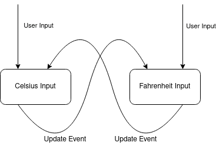

# Seven GUIs in reflex-vty, Part 2: The Temperature Converter

> 7GUIs defines seven tasks that represent typical challenges in GUI programming
> -- [7GUIs: A GUI Programming Benchmark](https://eugenkiss.github.io/7guis/)

[7GUIs](https://eugenkiss.github.io/7guis/) is a set of 7 typical GUI programming tasks of varying levels of complexity. We're going to implement the 7GUIs in [Haskell](https://haskell.org) using the [reflex](https://reflex-frp.org) [functional reactive programming](https://en.wikipedia.org/wiki/Functional_reactive_programming) framework.

## The structure of this document

This tutorial is packaged, like most Haskell applications and libraries, as a [cabal](https://www.haskell.org/cabal/) package. It was created by running `cabal init`. One thing that is a little unusual, though not unheard of, is that the source file for this package is a [literate Haskell](https://wiki.haskell.org/Literate_programming) file. Everything outside of code blocks that begin with "\`\`\`haskell" will be ignored by the compiler.

We use the [markdown-unlit](https://github.com/sol/markdown-unlit) preprocessor to allow us to write the tutorial in markdown (rather than one of Haskell's built-in literate document styles) but still allow the code blocks to be recognized and compiled.

Each of the code snippets will be a function that can be run on its own in the REPL. The functions will gradually grow in complexity until the final version implements the desired GUI. This isn't how you'd normally program, but we're trying to "show our work" so that you can see how we build up the GUI in smaller steps.

> NB: One limitation of the format we've chosen (a single literate haskell source file) is that the module imports have to be declared in one place, above all of the code, so the first code you see will include imports that aren't needed until later. We'll use qualified imports to try to make it clear why something is being imported.

This the second blog post in a series of seven, about implementing [7GUIs: A GUI Programming Benchmark](https://eugenkiss.github.io/7guis/). In this series, we explore various data flow patterns, and how to approach certain programming challenges with [`reflex-vty`](https://hackage.haskell.org/package/reflex-vty).
This tutorial is packaged, like most Haskell applications and libraries, as a [cabal](https://www.haskell.org/cabal/) package.
For more details about the structure of this document, we refer to the [first blog post](https://obsidian.systems/blog/seven-guis-vty-1-counter).

## The code

We will jump right into it! This tutorial assumes you have read the [first blog post](https://obsidian.systems/blog/seven-guis-vty-1-counter) in this series; as such, we won't explain functions that have been encountered before again. First, let's get started with the preliminaries.

### Imports

As mentioned above, we'll start by importing the libraries our project depends on. Don't worry if you don't understand why something is in the import list: we'll explain that as we go.

```haskell
-- These imports are unqualified because we'll be using them heavily
import Reflex
import Reflex.Vty

import qualified Graphics.Vty as V
import qualified Data.Text as T
import qualified Data.Text.Zipper as Z
import qualified Text.Read as Read
```

## What we have so far

We start with the code from our previous blog post. As a reminder, we ended up with something like this:

```haskell
counter :: IO ()
counter = mainWidget $ initManager_ $ do
  getout <- ctrlc
  tile flex $ box (pure roundedBoxStyle) $ row $ do
    rec grout flex $ text numClicksText
        buttonClicked <- tile flex $ textButton def "Count"
        numClicks <- count buttonClicked
        let numClicksText = current $ fmap (T.pack . show) numClicks
    return ()
  return $ fmap (\_ -> ()) getout

ctrlc :: (Monad m, Reflex t, HasInput t m) => m (Event t KeyCombo)
ctrlc = keyCombo (V.KChar 'c', [V.MCtrl])
```

When we run this application, we see a nice little GUI:


Now, for our next challenge, we want to have a temperature converter! Given some input interpreted in degrees Celsius, it will produce an output in Fahrenheit. This on its own is not that complicated, but we want to have a two-way update cycle. That is, we may enter some temperature in Celsius, but we may also do it the other way round, inputting degrees Fahrenheit and having the application calculate that amount in Celsius degrees.

The exemplar for this GUI challenge looks like this:


As we can see, our GUI consists of similar parts as before: we have a frame, multiple textfields, and some labels. We will start from our previous program to avoid retyping all this plumbing, making small adaptations to it until we reach the program we desire.

## The temperature converter GUI

The first thing we will need is a way to enter some input. The right function for this job is `textInput` with the following signature:

```
textInput :: (Reflex t, MonadHold t m, MonadFix m, HasInput t m, HasFocusReader t m, HasTheme t m, HasDisplayRegion t m, HasImageWriter t m, HasDisplayRegion t m) => TextInputConfig t -> m (TextInput t)
```

Just like last time, this is a lot to look at. However, by now you've most likely realized that you can ignore almost everything in front of the fat arrow `=>` for the sake of simplicity, since an intuitive understanding of the signature suffices. The only thing we truly care about is the part after `=>`, namely:

```
TextInputConfig t -> m (TextInput t)
```

This essentially tells us that we can *configure* our `textInput` in *some* way, and then we get a `TextInput`, that we most likely can use to get the contents of the `textInput`.

> NB: We use `textInput` to refer to the text input that can be seen on the screen, and `TextInput` to refer to the data type that is returned by `textInput`.

### Text Input in reflex-vty

Let's start using a `textInput`! We can use it just like we did `textButton` for the first GUI challenge:

```haskell
singleTextInput :: IO ()
singleTextInput = mainWidget $ initManager_ $ do
  getout <- ctrlc
  tile flex $ box (pure roundedBoxStyle) $ row $ do
    rec tile flex $ textInput def
    return ()
  return $ fmap (\_ -> ()) getout
```

We basically deleted everything that takes care of the counter logic and replaced that with a single `tile flex $ textInput def`.

Running this renders roughly as follows:


After you click on the text input, you can freely enter anything you'd like.

Just as with `textButton`, the function `def` creates a default value for the type `TextInputConfig`. We will take a much closer look at it later, but let's finish the layout first.

This time, we don't need a very complex layout: just two text inputs and two labels in a single row.

```haskell
multipleTextInputLayout :: IO ()
multipleTextInputLayout = mainWidget $ initManager_ $ do
  getout <- ctrlc
  tile flex $ box (pure roundedBoxStyle) $ row $ do
    rec tile flex $ textInput def
        grout flex $ text "Celsius ="
        tile flex $ textInput def
        grout flex $ text "Fahrenheit"
    return ()
  return $ fmap (\_ -> ()) getout
```


> As an exercise, fool around with the layout! Make it column based, or add a white box around the textInput to make it easier to see.

In both text inputs, we can enter text, but neither of the text inputs reacts to the contents of the other. That's not what we want, so let's change that!

### Convert Celsius to Fahrenheit

As a first step, we want to be able to enter a number in the "Celsius" input field, and have it update the contents of the "Fahrenheit" input field whenever the input of the former is a number. If it isn't, we won't update the input field. Ah, well, but how are we supposed to do this? We will have to take a look at [`TextInput`](https://hackage.haskell.org/package/reflex-vty-0.2.0.1/docs/Reflex-Vty-Widget-Input-Text.html#t:TextInput) and [`TextInputConfig`](https://hackage.haskell.org/package/reflex-vty-0.2.0.1/docs/Reflex-Vty-Widget-Input-Text.html#t:TextInputConfig). Here are the fields that are relevant to us:

```
data TextInputConfig t = TextInputConfig
  { _textInputConfig_initialValue :: Z.TextZipper
  , _textInputConfig_setValue :: Maybe (Event t Z.TextZipper)
  ...
  }
```

> NB: we removed documentation for the fields, as it mentions things we are not ready to talk about yet; however, do notice that the documentation covers what we talk about here.

The two fields from `TextInputConfig` we care about for this challenge are `_textInputConfig_initialValue` and `_textInputConfig_setValue`. Both of these fields work somehow with `Z.TextZipper`, but we don't know yet what `Z.TextZipper` is, so we have to make a very quick detour.

`Z.TextZipper` is a slightly more complicated data structure than plain `Text`, because it saves more information. For example, the `Z.TextZipper` allows us to choose where the cursor currently is in the text input. For the sake of simplicity, you can assume that `Z.TextZipper` is basically a string with extra information that is necessary for more complex user interaction, but it is also kind of an implementation detail.

Ok, now that we have established `Z.TextZipper` is basically `Text`, or a string, we can take a look at the fields we care about again.

```
data TextInputConfig t = TextInputConfig
  { _textInputConfig_initialValue :: Z.TextZipper
  , _textInputConfig_setValue :: Maybe (Event t Z.TextZipper)
  ...
  }
```

The expected value of `_textInputConfig_initialValue` becomes now apparent: it is just some string that we want to display at the very beginning. Thanks to `OverloadedStrings`, we may even just write a string directly.
On the other hand `_textInputConfig_setValue` looks a bit more complicated than it is. It basically just says: if an event is supplied, then whenever that event triggers, set the value of the text input to the `Z.TextZipper` value taken from our given Event. That seems straightforward enough and sounds like exactly the thing we are looking for! We just need to know when our text input changes. Maybe `TextInput` will shed more light on how:

```
data TextInput t = TextInput
  { _textInput_value :: Dynamic t Text
  , _textInput_userInput :: Event t TextZipper
  ...
  }
```

Aha! If you remember, a `Dynamic` is basically a `Behavior` and `Event` at the same time, *and* it even contains exactly what is written in our text input! Sounds like TextInput is exactly what need. Let's give it a try and hook up the `_textInput_value` from our Celsius input field with the `_textInputConfig_setValue` of our Fahrenheit input field.

```haskell
wrongSynchronizeCelsiusAndFahrenheit :: IO ()
wrongSynchronizeCelsiusAndFahrenheit = mainWidget $ initManager_ $ do
  getout <- ctrlc
  tile flex $ box (pure roundedBoxStyle) $ row $ do
    rec celsiusInput <- tile flex $ textInput def
        grout flex $ text "Celsius ="
        let celsiusEv = updated (_textInput_value celsiusInput)
        let fahrenheitConfig = def
              { _textInputConfig_setValue =
                  Just (fmap Z.fromText celsiusEv)
              }
        tile flex $ textInput fahrenheitConfig
        grout flex $ text "Fahrenheit"
    return ()
  return $ fmap (\_ -> ()) getout
```

> NB: `Z.fromText` converts a `Text` value to `Z.TextZipper`.

And it seems to be doing what we want:


### Cyclical update dependencies

However, this is unfortunately not entirely correct! In fact, we will run into problems as soon as we try to hook up the Fahrenheit text input back into `_textInputConfig_setValue` for Celsius. The issue is quite fundamental, since `Dynamic t Text` changes when either the user inputs something in the UI, or when `_textInputConfig_setValue` is used to update the value.

Let's walk through an example:

1. You input "42" into the celsius field.
2. The value of `_textInput_value celsiusInput` changes.
3. The event from `updated (_textInput_value celsiusInput)` is triggered.
4. This causes the Event `_textInputConfig_setValue` to fire, changing the value of `_textInput_value fahrenheitInput`.
5. Since the value of `_textInput_value fahrenheitInput` changes, the event `updated (_textInput_value fahrenheitInput)` fires.
6. Now, we set the value of `_textInput_value celsiusInput` again, and jump back to 3.

So, we have infinite update loop: no good!

> Try it out. Wire up the two textInputs as described and watch the UI hang immediately, not even rendering anything!

Let's take a look at a diagram to visualize the issue:



In short, our current design *can not* work. What we need instead is something that resembles this:


While these might almost look the same, the important bit is to separate the `User Input` and `setValue` events. Previously, we subscribed to the *change events* of our value in the text input. What we need is to subscribe to the events the *user creates*. And this is where the function `_textInput_userInput` comes into play. It only contains the events created by the user: the contents of our text input after the `User Input` events (e.g. keyboard presses, *etc*) have been applied to our text input.

Now that we know how to break up the cyclic update dependency, let's take a look at how we can keep the contents of our two text inputs truly synchronized:

```haskell
synchronizeTextInputs :: IO ()
synchronizeTextInputs = mainWidget $ initManager_ $ do
  getout <- ctrlc
  tile flex $ box (pure roundedBoxStyle) $ row $ do
    rec let celsiusConfig = def
              { _textInputConfig_setValue =
                Just (_textInput_userInput fahrenheitInput)
              }
        celsiusInput <- tile flex $ textInput celsiusConfig
        grout flex $ text "Celsius ="
        let fahrenheitConfig = def
              { _textInputConfig_setValue =
                  Just (_textInput_userInput celsiusInput)
              }
        fahrenheitInput <- tile flex $ textInput fahrenheitConfig
        grout flex $ text "Fahrenheit"
    return ()
  return $ fmap (\_ -> ()) getout
```

You should play around with this in your UI to make sure it actually does what we promise you.


### Convert the temperature

Now we that we have a bidirectional data flow setup, we can start implementing the actual feature that we want.

We start by introducing some helper functions:

```haskell
-- | Convert temperature in degree Fahrenheit to degree Celsius.
toC :: Double -> Double
toC f = (f - 32) * (5 / 9)

-- | Convert temperature in degree Celsius to degree Fahrenheit.
toF :: Double -> Double
toF c = c * (9 / 5) + 32

-- | Try to interpret the given 'TextZipper' as a number.
toNumber :: Z.TextZipper -> Maybe Double
toNumber tz = Read.readMaybe (T.unpack (Z.value tz))

-- | Put the given number into a `TextZipper`.
toTZ :: Double -> Z.TextZipper
toTZ val = Z.fromText (T.pack (show val))
```

Functions such as `T.pack` and `T.unpack` are necessary for converting from strings to Text and vice versa. The most interesting function is `readMaybe :: Read a => String -> Maybe a` which tries to read a string and translates it into a value of our choice. In this particular case, we want it to be a `Double`, hence `toNumber` produces a `Maybe Double`.
These functions are not particularly interesting, but they make the following implementation much simpler.

First, we want the Fahrenheit input to always display the input from the Celsius text field:

```haskell
celsiusToFahrenheit :: IO ()
celsiusToFahrenheit = mainWidget $ initManager_ $ do
  getout <- ctrlc
  tile flex $ box (pure roundedBoxStyle) $ row $ do
    rec celsiusInput <- tile flex $ textInput def
        grout flex $ text "Celsius ="
        fahrenheitInput <- tile flex $ textInput def
            { _textInputConfig_setValue = Just setFahrenheitEvent
            }
        grout flex $ text "Fahrenheit"
        let setFahrenheitEvent =
              fforMaybe (_textInput_userInput celsiusInput) $ \val ->
                case toNumber val of
                  Nothing -> Nothing
                  Just num -> Just (toTZ (toF num))
    return ()
  return $ fmap (\_ -> ()) getout
```

For this step, we remove the bidirectional data-flow to make it easier to understand.

Our program looks like this:


Now to the actual code. Most of it should feel familiar, except for [`fforMaybe`](https://hackage.haskell.org/package/reflex-0.8.2.1/docs/Reflex-Class.html#v:fforMaybe). Let's take a closer look.

```
fforMaybe :: Filterable f => f a -> (a -> Maybe b) -> f b
```

The function `fforMaybe` allows us to map over something, but also, at the same time, to discard *something*. It is basically a `Functor`, but you can also decide to *discard* values from it. In the case of `Event`, this means that we can take the `Event` and decide, based on the contents of the `Event`, to not trigger the `Event` anymore.

Why do we need this in this case? Well, parsing a string to a number may fail since `"not a number"` would not be a valid number. Of course, we could return some kind of default value in that case, but our assignment says specifically:

> When the user enters a non-numerical string into $T_C$ the value in $T_F$ is not updated and vice versa.

where $T_C$ and $T_F$ are the text fields for Celsius and Fahrenheit respectively.

Thus, using `fforMaybe`, if we return a `Nothing`, we will not update the text field of our Fahrenheit text input. Hooray, we are almost there!

### Putting it together

Ok, we've learned a lot. We've learned how to model complex data flow patterns, but at the same time, we've also taken a close look at how **not** to model complex data flow patterns. Hopefully this has been instructive for you.

Now that we know how to model the bidirectional data flow pattern between two text inputs, and we know how we have to modify the events to apply the temperature conversion correctly, we come to the grand finale. It is just a matter of duplicating the work we have done to convert Celsius to Fahrenheit.

```haskell
bidirectionalTemperature :: IO ()
bidirectionalTemperature = mainWidget $ initManager_ $ do
  getout <- ctrlc
  tile flex $ box (pure roundedBoxStyle) $ row $ do
    rec celsiusInput <- tile flex $ textInput def
            { _textInputConfig_setValue = Just setCelsiusEvent
            }
        grout flex $ text "Celsius ="
        fahrenheitInput <- tile flex $ textInput def
            { _textInputConfig_setValue = Just setFahrenheitEvent
            }
        grout flex $ text "Fahrenheit"
        let celsiusEv = _textInput_userInput celsiusInput
            fahrenheitEv = _textInput_userInput fahrenheitInput
            setCelsiusEvent =
              fforMaybe fahrenheitEv $ \val ->
                case toNumber val of
                  Nothing -> Nothing
                  Just num -> Just (toTZ (toC num))
            setFahrenheitEvent =
              fforMaybe celsiusEv $ \val ->
                case toNumber val of
                  Nothing -> Nothing
                  Just num -> Just (toTZ (toF num))
    return ()
  return $ fmap (\_ -> ()) getout
```

This is more of the same as before. We wire up the user input events from the two text inputs, and only if the input is a number do we update the shown text in the text field. We have achieved our goal. The only thing left to do is to watch in amazement.


Let's plug that into `main` so that the compiled executable runs our final version.

```
main :: IO ()
main = bidirectionalTemperature
```

### Tidy up

Be not mistaken, our program is done, but we can still improve it a bit by removing the code duplication that is `setCelsiusEvent` and `setFahrenheitEvent`. The only differences between them are which `Event` we are handling and how to convert the parsed value into Fahrenheit or Celsius respectively. Thus, we pull it out like this:

```haskell
convertEvent :: Reflex t => (Double -> Double) -> Event t Z.TextZipper -> Event t Z.TextZipper
convertEvent conv ev =
  fforMaybe ev $ \val ->
    case toNumber val of
      Nothing -> Nothing
      Just num -> Just (toTZ (conv num))
```

and then we may refactor our code to use that utility function:

```haskell
thisIsIt :: IO ()
thisIsIt = mainWidget $ initManager_ $ do
  getout <- ctrlc
  tile flex $ box (pure roundedBoxStyle) $ row $ do
    rec
        let setCelsiusEvent = convertEvent toC (_textInput_userInput fahrenheitInput)
        let setFahrenheitEvent = convertEvent toF (_textInput_userInput celsiusInput)
        celsiusInput <- tile flex $ textInput def
            { _textInputConfig_setValue = Just setCelsiusEvent
            }
        grout flex $ text "Celsius ="
        fahrenheitInput <- tile flex $ textInput def
            { _textInputConfig_setValue = Just setFahrenheitEvent
            }
        grout flex $ text "Fahrenheit"
    return ()
  return $ fmap (\_ -> ()) getout
```

With this refactoring, our code is concise, but still readable, once you understand how the "wiring" works with `reflex`.

Make sure to run our *real* final version.

```haskell
main :: IO ()
main = thisIsIt
```

Thanks for reading. Tune in next time for a walkthrough of the [flight booker](https://eugenkiss.github.io/7guis/tasks/#flight) task.
